**Introduction to Linux Containers and Docker**
================================================

Introduction
------------

Welcome to *Introduction to Linux Containers and Docker*. In this session we will try to get started in the world of Docker containers, the necessity of them and how to start developing, testing and running applications using Docker.

This will be a hands-on approach, so if you are following this tutorial solely based on this document, please make sure to [check the Docker Documentation](https://docs.docker.com).

Install Docker
---------------

First of all you need to install Docker on your system. Docker runs on Linux, macOS and Windows 10, as well as in the Cloud.

For a full list of OS versions and distributions that Docker can run, please [check this resource](https://docs.docker.com/engine/installation/).


> [Install Docker on Ubuntu](https://docs.docker.com/engine/installation/linux/ubuntu/)

> [Install Docker on Windows 10](https://docs.docker.com/docker-for-windows/install/)

> [Install Docker on Mac](https://docs.docker.com/docker-for-mac/install/)


To verify that you have successfully installed Docker on your machine, open a command-line prompt (it can be CMD or PowerShell on Windows, Bash on Linux or Terminal on macOS) and type `docker ps`.

This command will output all running containers on your machine - and if this is the first time you installed Docker, there should be no running containers.

Run `hello-world`
----------------

Now that we have Docker installed, it is time to run our first container, a `hello-world` container. In the same command-line prompt, type `docker run hello-world` and press Enter. This command does some work for you, mainly it prints a message, then explains how things worked.


> Image from the [Docker Documentation](https://docs.docker.com/engine/getstarted/step_two/)

This is how things should look like if everything went fine:


> If you want to see how this works, [please check the GIitHub repository responsible for this image](https://github.com/docker-library/hello-world)

Now if we run `docker ps` again, the output will be the same: there is no container running. If we want to see all containers that previously ran, execute `docker ps -a`, with the following output:

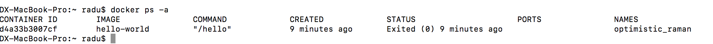

Let's take things one by one:

- first of all, we have `CONTAINER ID` that Docker generates for us. It is used to uniquely identify containers.
- then, we have `IMAGE` - this is the image that was used to instantiate this container - more on images and containers soon.
- next we have `COMMAND` - this is the command used to start the container
> The command used to start the container is specified as [the last line in the Dockerfile here](https://github.com/docker-library/hello-world/blob/master/hello-world/Dockerfile), and [this is the C program that generated the `hello` binary](https://github.com/docker-library/hello-world/blob/master/hello.c)
- next we have `CREATED` and `STATUS` which indicate when the container was created and what is its status
- now we have `PORTS`. While we will not get into Docker networking right now, it is good to know that you can do a mapping between host ports (ports on your machine) and ports inside the container. This container exposes no ports.
- lastly, we have `NAMES`, which is some funny and also unique (in your instance of Docker) friendly name that Docker generates

> [If you want to know how Docker generates the random names for containers, here it is](https://github.com/docker/docker/blob/master/pkg/namesgenerator/names-generator.go).


What about images and containers?
---------------------------------


[According to the Docker Documentation](https://docs.docker.com/engine/getstarted/step_two/), an image is a filesystem and parameters to use at runtime. It doesn’t have state and never changes. **A container is a running instance of an image**.

When you ran the command, Docker Engine:

- checked to see if you had the hello-world software image
- downloaded the image from the Docker Hub (more about Docker Hub later)
- loaded the image into the container and “ran” it


Containers are immutable
------------------------

The container we ran so far didn't allow us to make any modifications to it. It ran a single binary file, then exited. But we have a lot of flexibility when running containers. For example, we can run a container based on the default Ubuntu image:

`docker run -i -t ubuntu:latest bash`

This command will run the latest version of the official `ubuntu` and will start the `bash` process. The `-it` flag will start the container and attach a pseudo-tty and keep sdtin open.

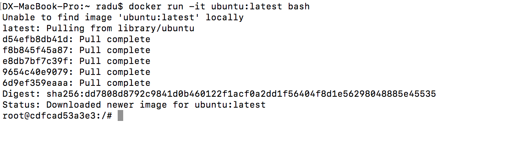

We can see that this opens a prompt where we are the `root` user. If we open a new terminal and type `docker ps`, we can see the container running with the `bash` command used to start it.

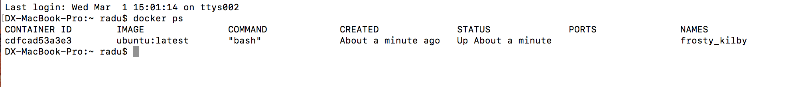

Back to the container, we are now in an isolated environment (not that isolated, but more on this later). This environment has nothing to do with our host, and we can check the Linux version with `uname -a`.

In order to show that containers are immutable, we are going to create a new file in `/` folder of our container:

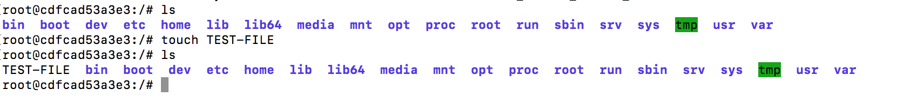

Now go to another prompt and start another container using the same `docker run -i -t ubuntu:latest bash` command.

> Notice that this time the container started much faster, because the `ubuntu` image was already downloaded.

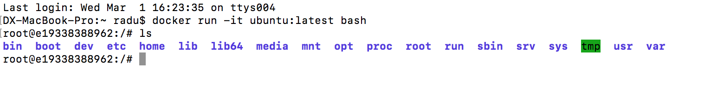

Notice that first of all we have a new container, with a new ID. Next, notice that the file is missing, so containers are immutable. Any change you make inside the container, it will disappear once that instance stops.

> Notice that if you exit `bash`, the container will stop. This is because the `bash` process was the one used to start the container in the first place and the lifetime of the container is tied to the lifetime of the process that was used to start it.

Running a simple web application
---------------------------------

In order to understand the following section, you need to understand the level of isolation a container has. Each container gets its own:

    - root directory - file system
    - eth0 network interface - network
    - PID0 - process space

For this section we are interested in the networking part. By default, Docker containers run in a default `bridge` network that Docker creates on your machine, and by default, containers can connect to the outside world (`ping google.com`), but the outside world cannot connect to a container.

> Each outgoing request coming from a container will originate from the host's IP address.

If you want your container to accept incoming requests (as is the case for a web application), you need to provide special flags when executing the `docker run` command.

For example, if in our container we listen for requests on port 80, we can map it on a host port - this can be any user-accessible port on the host - 80 or otherwise. 

`docker run -p <host-port>:<container-port> <your-image>`

This command will bind `<container-port>` to `<host-port>`.

> For more information about networking with Docker containers, [check the Docker Documentation](https://docs.docker.com/engine/userguide/networking/).

Before anything, we need a working web application, and we are going to use an [Apache and PHP application you can find on GitHub](https://github.com/radu-matei/apache-php).

> The application is forked from a [very similar application developed by CloudHero](https://github.com/cloud-hero/apache-php).

Right now we are going to download and run the application and bind port 80 from inside the container ([this port is exposed in the Dockerfile here](https://github.com/radu-matei/apache-php/blob/master/Dockerfile#L39) - more on the Dockerfile later) to any port you choose on the host (from the available ports on the host) - here we will choose 8080.

The application is [also available on Docker Hub here](https://hub.docker.com/r/radumatei/apache-php/).

`docker run -it -p 8080:80 radumatei/apache-php`

> Docker will try to find the image locally, and when it doesn't find it, it will go to Docker Hub and download it.

After the container starts, navigate to `http://localhost:8080` on your computer. You should see something similar:

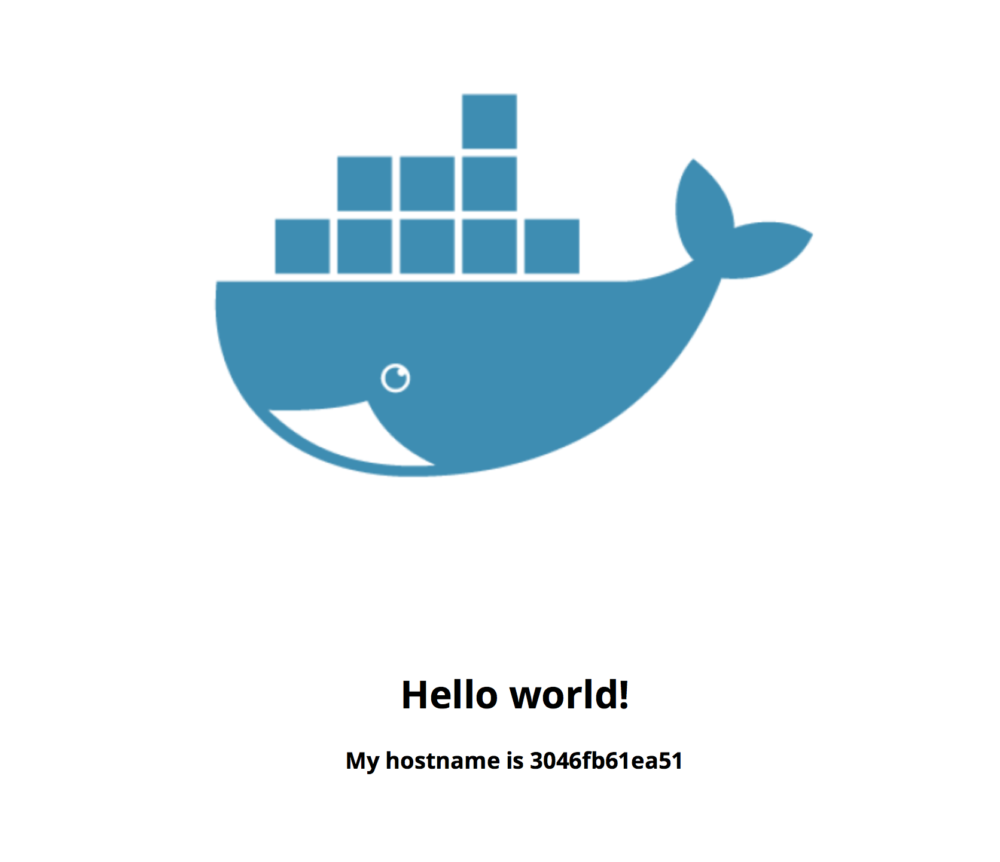

The page will display the hostname of the container it is running in, and here are the logs from the application (notice in the Dockerfile that the application was started in the foreground, and we started the container with an interactive terminal).

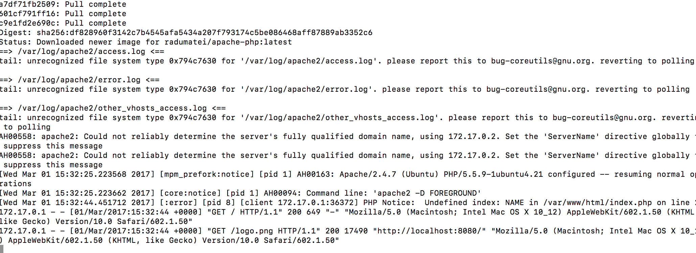


Running containers in `detached` mode
--------------------------------------

We can also run containers in `detached` mode, meaning that we will not see the logs. This can be done by passing the `-d` flag instead of passing `-it`.

`docker run -d -p 8080:80 radumatei/apache-php`

> Note that if you didn't stop the previous container, you will not be able to run this on the same host port and will have to choose another port, for example 8081.

The output of this command will be the ID of the container that was just created, and you have control to the prompt again. In order to see that the container is actually running, you can again go to your browser to `http://localhost:8080` (or what port you provided), or run `docker ps`.

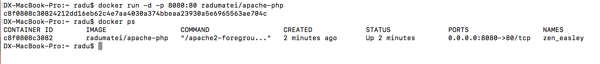

Here you can clearly see the container running with all necessary information.

> Notice the port binding between the container (port 80) to the host (port 8080).

But at this moment you are left outside your container. You cannot see what's happening inside it, nor can you execute commands.

[`docker attach`](https://docs.docker.com/engine/reference/commandline/attach/)
--------------

`docker attach <container-name-or-id>` is used to attach to a running container without executing anything new inside that container, but simply attach to it.

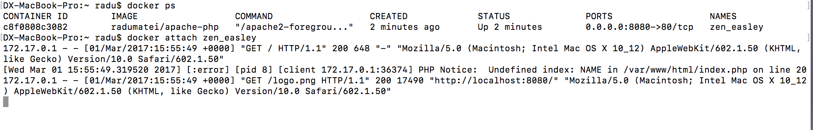

And once the application receives requests, you can see again the logs just like when we started the container with the `-it` flag.

[`docker exec`](https://docs.docker.com/engine/reference/commandline/exec/)
-------------

`docker exec <container-name-or-id>` is used to run a command / process in a running container. It can be a shell, or any other commands. Let's start a new bash session inside our running container.

For example, if you have a container with the name `zen_easley`, in order to start a new interactive bash session, you need to execute:

`docker exec -it zen_easley bash`

At this point, you will be able to alter the running container, so you can alter the application (since you are root).

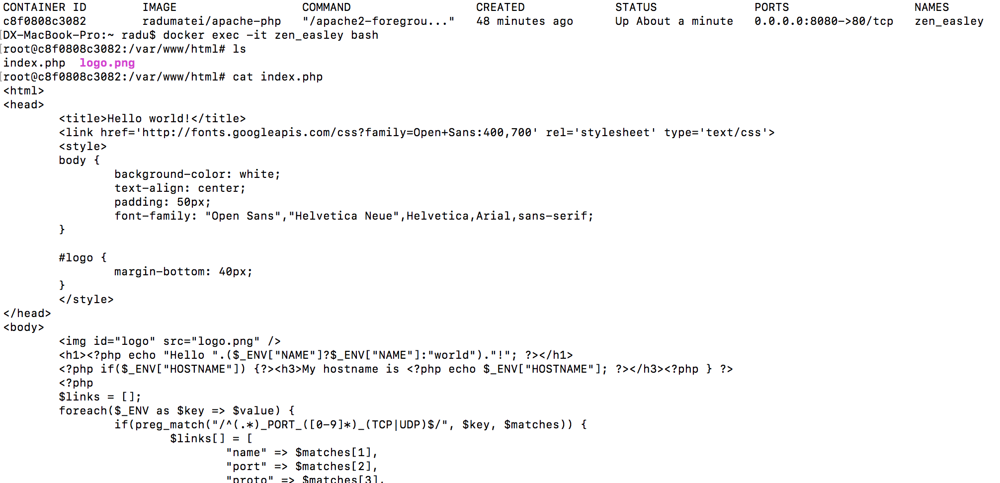

> Remember that any modifications you make inside the container will disappear when you start a new container based on the same image.


Manage data in containers
-------------------------

As you saw before, the containers are immutable. So any modifications made to the files inside will not persist once the container stops. In the next section we will look at how to manage data inside your containers, and will start with data volumes, which allow you to mount host directories, or even some shared volumes.

We will first look at how to mount host directories in containers. We will go back for a little while to running the container with the base `ubuntu` image, and we will mount a directory from the host to the container.

`docker run -it -v /Users/radu/Code/:/AwesomeFolderWithDifferentName ubuntu:latest bash`

This command will start an `ubuntu` container with the `bash` command, but will also mount the `Code` folder from the host to a folder inside the container with a name you can choose.

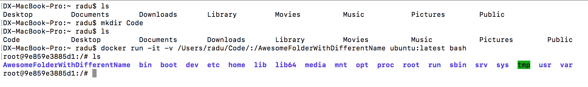

At this moment, any changes you make in that directory (from either side - the host or from the container) will be visible everywhere. For example, create a new file inside the `Code` folder on the host and verify if the file is present in the container.

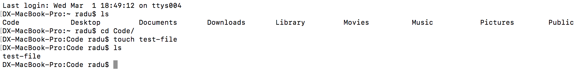
And the file is also visible from the container:
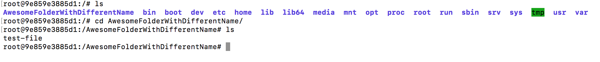

Creating your own image
-----------------------

Coming back to the PHP web application we ran earlier, you can clone it from GitHub using the following command:

`git clone https://github.com/radu-matei/apache-php`

Now navigate to the `apache-php` directory that got created for you and let's explore what's inside:

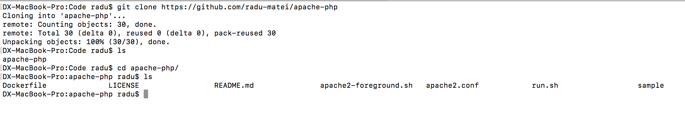

Let's take a look at the `Dockerfile` inside:

```
FROM ubuntu:trusty

# Install base packages
RUN apt-get update && \
    DEBIAN_FRONTEND=noninteractive apt-get -yq install \
        curl \
        apache2 \
        libapache2-mod-php5 \
        php5-mysql \
        php5-gd \
        php5-curl \
        php-pear \
        php5-mongo \
        php5-memcached \
        php-apc && \
    rm -rf /var/lib/apt/lists/* && \
    curl -sS https://getcomposer.org/installer | php -- --install-dir=/usr/local/bin --filename=composer && \
    sed -i "s/variables_order.*/variables_order = \"EGPCS\"/g" /etc/php5/apache2/php.ini

RUN rm -rf /var/www/html && mkdir -p /var/lock/apache2 /var/run/apache2 /var/log/apache2 /var/www/html && chown -R www-data:www-data /var/lock/apache2 /var/run/apache2 /var/log/apache2 /var/www/html

# Apache + PHP requires preforking Apache for best results
RUN a2dismod mpm_event && a2enmod mpm_prefork

RUN mv /etc/apache2/apache2.conf /etc/apache2/apache2.conf.dist && rm /etc/apache2/conf-enabled/* /etc/apache2/sites-enabled/*
COPY apache2.conf /etc/apache2/apache2.conf

# Add image configuration and scripts
ADD apache2-foreground.sh /apache2-foreground.sh
RUN chmod 755 /*.sh

# Add sample welcome page
ADD sample/ /var/www/html/

VOLUME /var/www/html
WORKDIR /var/www/html

EXPOSE 80

CMD ["/apache2-foreground.sh"]
```

> These are all the necessary steps required in order to run an Apache + PHP application on a clean Linux environment.

When an image is built, Docker will read all the steps involved in the Dockerfile and will execute them sequentially. You can see in the Dockerfile that you:

- start with a base `ubuntu` image
- add packages for `curl`, `apache`, `php` and others
- add your application files
- expose a port (80)
- run the application based on a command or script

At this point, we can modify the application that is located under `samples`, build our own image and start contaieners based on this image:

Let's modify the `index.php` file and add the following line:

`<h1>I am Radu and I know Docker!<h1>`

Now let's build the image again: in the same directory as the Dockerfile, execute: `docker build -t my-apache-php .` (The dot `.` indicates that the Dockerfile is in the current directory).

At this point you will see every line from the Dockerfile in execution: `STEP i/14`

> Note that this might take a while since there are a lot of dependencies installed  

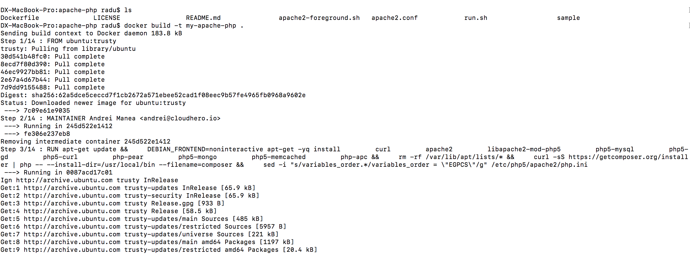

Once it finishes, you should see the image if you execute `docker images`:

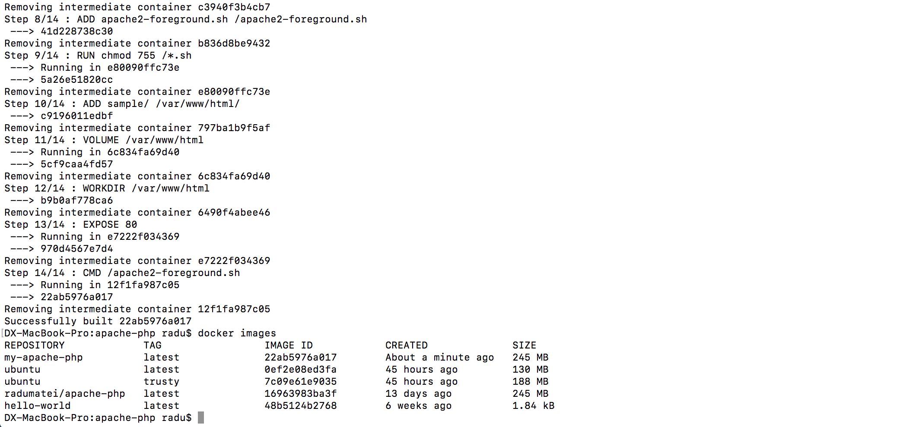

> Notice that for every step in the Dockerfile, Docker will build an intermidiate container that will help in case the process fails at the next step. If everything goes well, at step `i+1`, the system will remove the `ith` intermediate container.

At this point, we can start a new container based on the image we just created:

`docker run -d -p 8080:80 my-apache-php`

This should be the result:

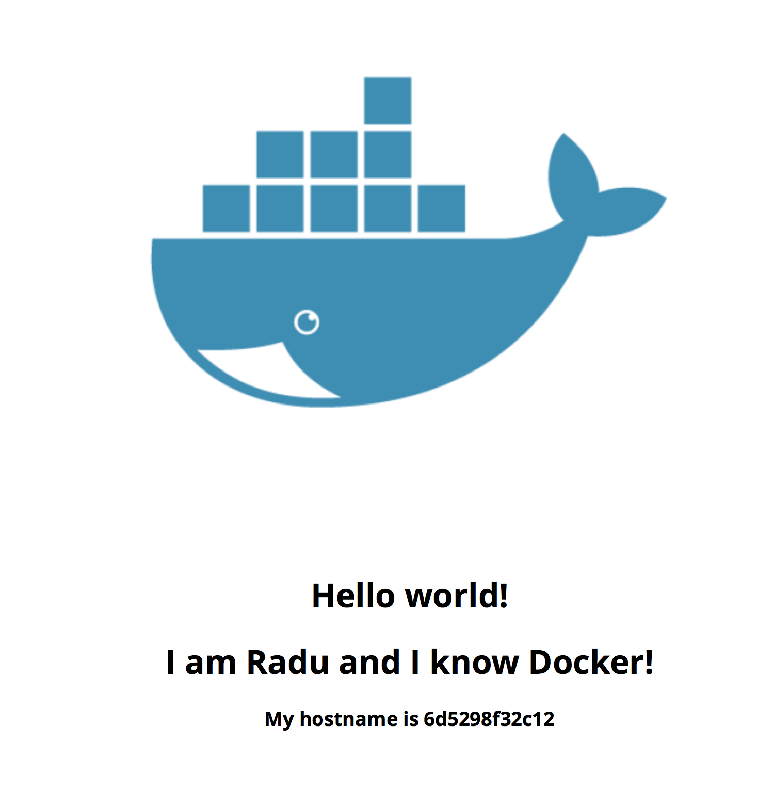

Distribute the image you created. Docker Hub
--------------------------------------------

At the moment, the application image only exists on your machine. What if you want to share this image? Or run start containers based on this image on other servers, on other infrastructure?

The answer - a container registry - think at it in the same way you think at GitHub - but this is for Docker images. You can create your own container registry, or use the one from Docker called Docker Hub.

First of all, we need to create a Docker Hub account. You can [learn all about creating the Docker Hub account here](https://docs.docker.com/engine/getstarted/step_five/).

Assuming you created your Docker Hub account, now it's time to tag and push the image we created to Docker Hub, using the username of your Docker Hub account:

`docker tag my-apache-php <dockerhubusername>/<name-of-image>`

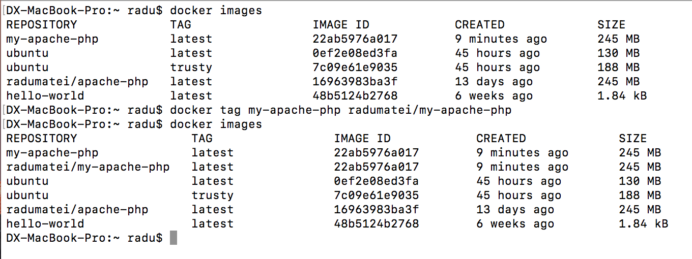

Next you need to login using the `docker login` command, then execute `docker push <dockerhubusername>/<name-of-image>`:

